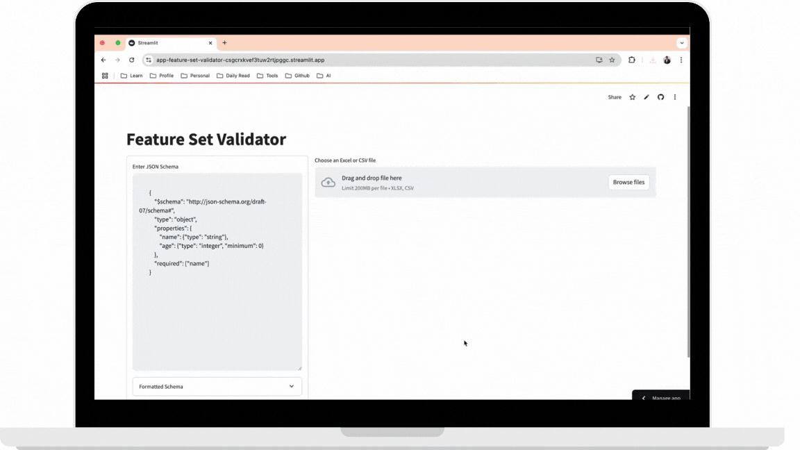

<p align="center">
  <a href="https://github.com/santoshshinde2012/streamlit-crop-disease-risk-prediction/actions/workflows/main.yml" target=”_blank”>
     
  </a>
</p>


# 📦 [Feature Set Validator](https://medium.com/gitconnected/bridging-the-domain-ai-gap-a-collaborative-application-driven-machine-learning-model-0d10939f6525)

Streamlit is a powerful tool for creating interactive web applications using Python. However, there are times when the built-in components may not meet your specific needs. In such cases, you can create custom components using modern front-end technologies like Vite, React, and TypeScript. This guide will walk you through the process of setting up a custom component for your Streamlit app, enabling a seamless integration of sophisticated front-end features with the simplicity of Python.


## How to run locally

1. Make sure to install required python packages
   
```
pip install -r requirements.txt
```

2. Run Streamlit App

```
streamlit run streamlit_app.py

```

## Demo App

[](https://app-feature-set-validator-csgcrxkvef3tuw2rtjpggc.streamlit.app/)


<p align="center">
  <a href="https://app-feature-set-validator-csgcrxkvef3tuw2rtjpggc.streamlit.app/">
     
  </a>
</p>


## Further Reading

- [30 Days of Streamlit](https://30days.streamlit.app/)
- [How to build your own Streamlit component](https://blog.streamlit.io/how-to-build-your-own-streamlit-component/)
- [Understanding Streamlit's client-server architecture](https://docs.streamlit.io/develop/concepts/architecture/architecture)
- [Wiki](https://github.com/streamlit/streamlit/wiki)
- [Bridging the Domain-AI Gap: A Collaborative Application-Driven Machine Learning Model
](https://medium.com/gitconnected/bridging-the-domain-ai-gap-a-collaborative-application-driven-machine-learning-model-0d10939f6525)

## Tutorials 
- [Getting Started with Streamlit and Custom Streamlit Components](https://medium.com/@santosh-shinde/getting-started-with-streamlit-and-custom-streamlit-components-491bd197cd9f)
- [Bridging the Domain-AI Gap: A Collaborative Application-Driven Machine Learning Model](https://medium.com/gitconnected/bridging-the-domain-ai-gap-a-collaborative-application-driven-machine-learning-model-0d10939f6525)
  

### Connect with me on
<div id="badges">
  <a href="https://twitter.com/shindesan2012">
    
  </a>
  <a href="https://www.linkedin.com/in/shindesantosh/">
    
  </a>
   <a href="https://blog.santoshshinde.com/">
    
  </a>
  <a href="https://www.buymeacoffee.com/santoshshin" target="_blank">
    
    </a>
</div>